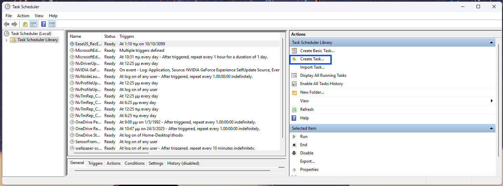
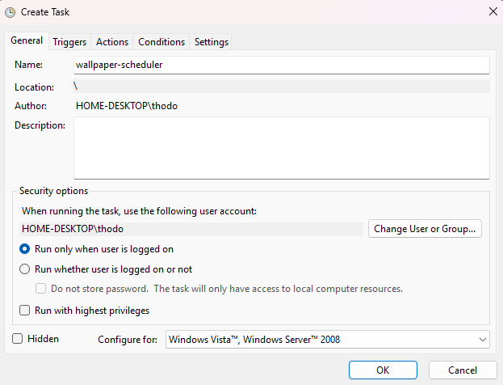
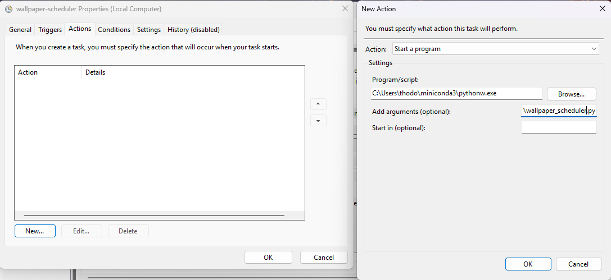
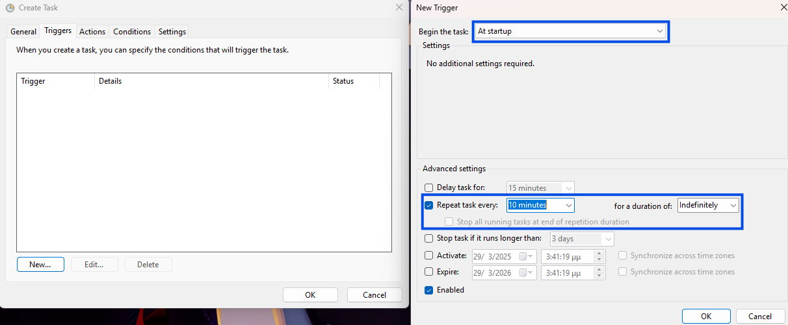

# Windows Day Night Wallpapers Carousel

This repository includes a single script that changes your wallpaper based on the time of day in your location. It picks daytime wallpapers froms sunrise to sunset and nighttime wallpapers from sunset to sunrise.

This script is setup as a scheduled program using the windows task scheduler.

**Requirements**: Python 3.7 or above and conda. It has only been tested on Windows 11.

## Set Your Parameters

Modify the `config.json` file to set your parameters:
```
{
    "morning_wallpaper_dir": windows_path_to_morning_wallpapers (e.g. "C:\\Users\\thodo\\Pictures\\wallpapers\\morning"),
    "night_wallpaper_dir": windows_path_to_night_wallpapers (e.g. "C:\\Users\\thodo\\Pictures\\wallpapers\\night"),
    "city": "YourCity" (e.g. "Athens"),
    "country": "YourCountry" (e.g. "Greece"),
    "timezone": "YourTimezone" (e.g. "Europe/Athens"),
    "latitude": CityLatitude (e.g. 37.9838),
    "longitude": CityLongitude (e.g. 23.7275)
}
```

The wallpaper images that are used are the `png` and `jpg` files in the morning and night wallpaper directories. You can add as many images as you want in these directories. The script will randomly select one of the images in the directory.

## Setup Script as a Scheduled Task

In order for the script to run automatically, you need to set it up as a scheduled task. You can do this by following these steps:

1. Open the Task Scheduler
2. Click on "Create Task"<br>

3. In "General" tab set a name for your task<br>

4. Then head on to the "Action" tab and click on "New". On program/script seth the path to the `pythonw.exe` in your conda env and in the "Add arguments" field set the path to the `wallpaper_scheduler.py` file and click "OK".<br>

5. Finally, in the "Triggers" tab click on "New". Set the begin the task "At startup" and set your desired repeat interval with duration set to "Indefinitely". Click "OK".<br>


Your task is now setup. Restart your computer and you are ready!

## Debugging

You can review if anything went wrong by checking the `wallpaper_scheduler.log` file in the `logs` directory.